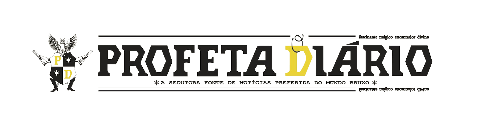

<h1 align="center">
    
</h1>

  <a href="#-tecnologias">Tecnologias</a>&nbsp;&nbsp;&nbsp;|&nbsp;&nbsp;&nbsp;
  <a href="#-projeto">Projeto</a>&nbsp;&nbsp;&nbsp;|&nbsp;&nbsp;&nbsp;
  <a href="#-layout">Layout</a>&nbsp;&nbsp;&nbsp;|&nbsp;&nbsp;&nbsp;
  <a href="#memo-licença">Licença</a>

  

 

  

## 🚀 Tecnologias

Esse projeto foi desenvolvido com as seguintes tecnologias:

- [HTML](https://developer.mozilla.org/pt-BR/docs/Web/HTML)
- [CSS](https://developer.mozilla.org/pt-BR/docs/Web/CSS)

## 💻 Projeto

O Profeta Diario é um projeto acadêmico desenvolvido em forma de um portal de entretenimento. O tema base "Daily Prophet" baseado no universo cinematográfico de Harry Potter. 💜

## 🔖 Layout

No link abaixo você encontra o video de apresentação do layout projeto web.

- [Layout Web](https://youtu.be/PUPj-1cDb04)

## 🧠 Easter Egg

Jogo da memória

 

## :memo: Licença

Esse projeto está sob a licença MIT. Veja o arquivo [LICENSE](LICENSE.md) para mais detalhes.

---

Made with 💖 by Bruna Silva👩‍💻

